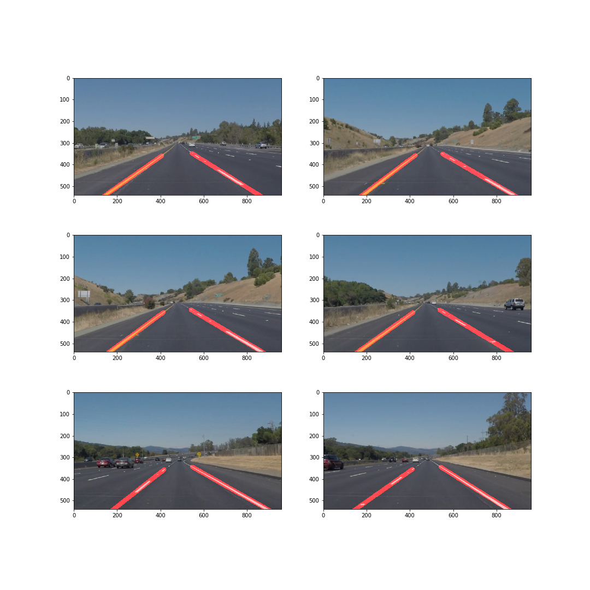

# **Finding Lane Lines on the Road** 

## Goals

Write simple algorithm which detects driving lanes on the video.

## Approach I used

In this work I applied operation to input image in this order:
1. Gaussian blur
2. Canny edge detection
3. Hough lines detection
4. Filtered region of interest
5. Run linear regression on the detected lines on the left/right sides
6. For video I used momentum to achive more stable and smooth transition between pictures

In the end I draw 2 lines I trained using linear regression on step 5 (for images). For video
I additionally use previously detected lines by adding current traind line to previous with coefficients.

## Results

Here is some results:

I achived "good enough" result on the challenge video by using idea with momentum and better region filtering.
It's kind of hacky, but I filtered lots of points on the road to achive robust results with shadows and differently
collored pavements.

### Suggest possible improvements to described pipeline

It's possible to run logisit regression with nonlinear features to achive good results on turns. But it would be
much harder, because detected lines would be less stable than current.

Also I haven't used color filtering at all. And I belive some smart color normalization will be less hacky solution, than
I did with filtering pavement in front of the car in the challenge video.
